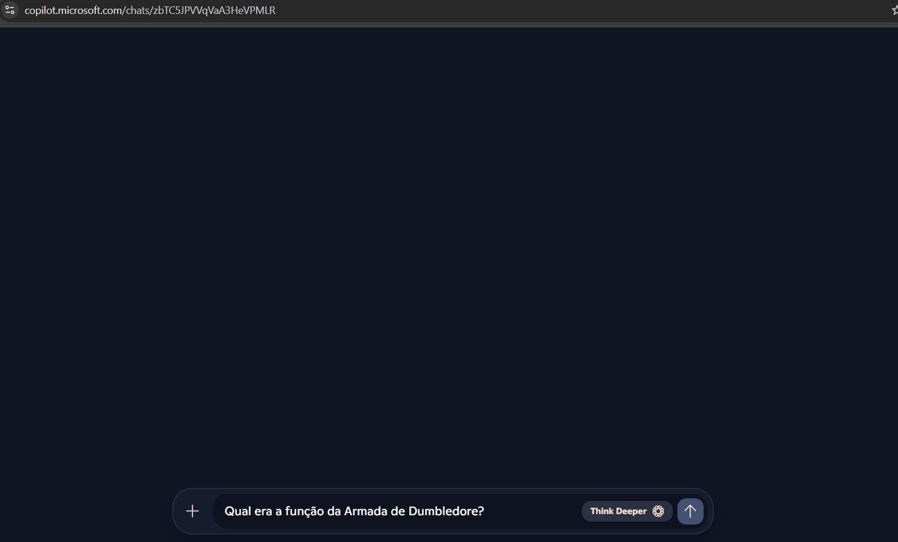
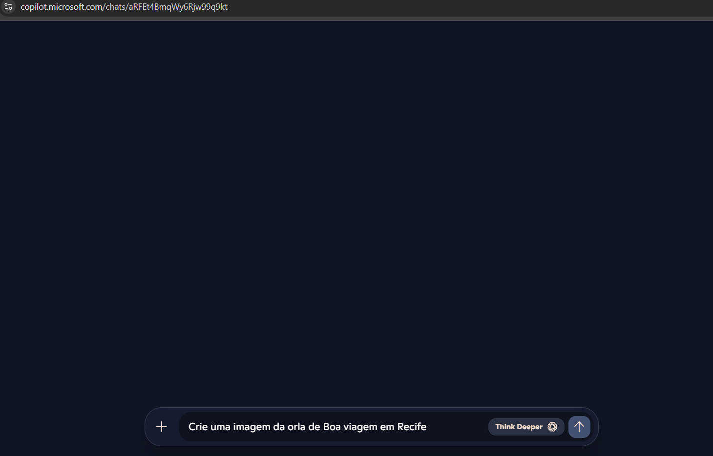
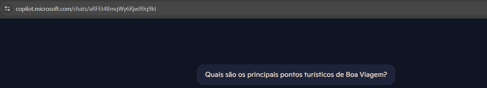
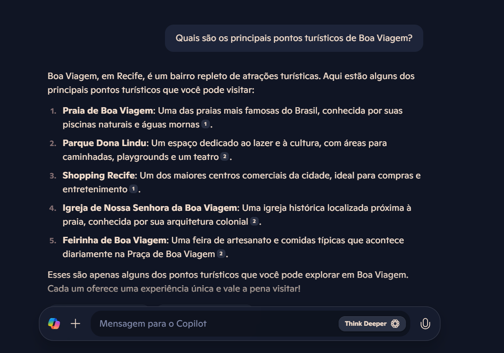

# Explorando IA Generativa com Copilot e OpenAI

Repositório Bootcamp Dio em Parceria com a Avanade.

## Lab05: Explorando os recursos de IA generativa com Copilot e OpenAI

### 📌 O que é IA Generativa?
A **Inteligência Artificial (IA)** é projetada para imitar o comportamento humano por meio de aprendizado de máquina, permitindo que interaja com o ambiente e realize tarefas sem instruções explícitas.

A **IA Generativa** vai além, sendo capaz de criar conteúdos originais a partir de entradas em linguagem natural. Alguns exemplos de suas aplicações incluem:
- **Geração de linguagem natural** → Criação e otimização de textos, como no ChatGPT.
- **Geração de código** → Auxilia no desenvolvimento e automação.
- **Criação de imagens** → Produção de imagens a partir de descrições, como DALL-E.

### 🧠 Modelos de Linguagem Grandes (LLMs)
Os aplicativos de IA generativa são impulsionados por **LLMs (Large Language Models)**, um tipo especializado de modelo de **Machine Learning** usado para tarefas de **Processamento de Linguagem Natural (PLN)**, como:

✔ Classificação e análise de sentimentos.

✔ Resumo de textos.

✔ Comparação de semelhança semântica entre textos.

✔ Geração de novos conteúdos em linguagem natural.

## 🤖 Copilotos
Os **Copilotos** são assistentes baseados em IA que integram grandes modelos de linguagem a aplicativos, facilitando tarefas do dia a dia. Desenvolvedores podem criar copilotos personalizados que geram conteúdos e auxiliam usuários diretamente nos aplicativos.

## 🎯 Engenharia de Prompt
A **engenharia de prompt** é a técnica utilizada para otimizar entradas de IA, melhorando a qualidade das respostas. Métodos incluem:
- Uso de linguagem direta.
- Inclusão de mensagens de sistema.
- Exemplos e dados de fundamentação para guiar a IA.

# Utilizando o Copilot

Este documento ilustra como o Copilot pode ser empregado para gerar e editar conteúdos por meio de IA, demonstrando exemplos práticos com textos e imagens.

---

## Exemplo 1: Geração de Texto

**Entrada:**
> "Qual era a função da Armada de Dumbledore?"

**Visual da Entrada:**

**Resposta da IA:**

---

## Exemplo 2: Criação de Imagens

**Entrada:**
> "Crie uma imagem da Orla de Boa Viagem em Recife"

**Visual da Entrada:**

**Saída Inicial da IA:**

**Imagem Gerada pela IA:**

---

## Exemplo 3: Geração de Texto

**Entrada:**
> "Quais são os principais pontos turísticos de Boa Viagem?"

**Visual da Entrada:**

**Resposta da IA:**

---

## Exemplo 4: Edição de Imagem

**Entrada:**
> "Edite a imagem da Orla de Boa Viagem, adicionando mais pessoas na areia da praia."

**Visual da Entrada:**

**Resultado da Edição:**

## Conclusão

Com este projeto, pude constatar de forma prática como as tecnologias de IA generativa estão transformando a maneira de interagir com conteúdos digitais. Ao trabalhar com o Copilot, mostrei a capacidade de gerar textos claros e imagens marcantes a partir de instruções simples, facilitando tanto a criação quanto a edição de materiais.
